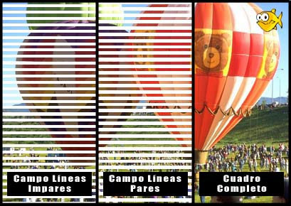
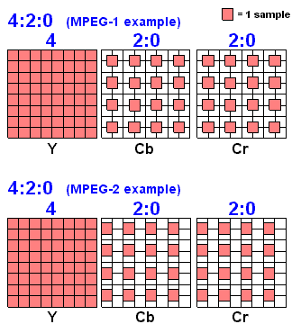
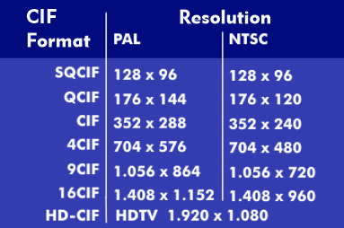

## Video Digital
- Representación de una escena visual del mundo real, muestreada de forma espacial y temporal.
- Las escenas usualmente se muestrean en un instante de tiempo para generar un frame.

**fps**: frames per second
Valores  comunes: 30,60,24.

- Un frame es una representacion completa de una escena visual en ese instante de tiempo.
- Los frames generalmente estan conformados por un numero o impar de lineas correspondientes al muestreo espacial.

> Que es video entrelazado? (720x1080i)
> Que es el video progresivo? (720x1080p)

Cada Pixel nos da la información del color en (RGB - Red Green Blue) y se utilizan **8 bits por muestra**.


[Enlace](https://www.youtube.com/watch?v=tksFNlMsglA)

Existen algunos formatos estandar como lo son:

- ITU-R 601 (Television Digital)
- Formatos de video de alta definición (High Definition)
- Formatos Intermedios (Intermediate Format)

> Revisar la resolución del formato 4k?.

Una metrica para evaluar la calidad de video es el PSNR (Peak Signal to Noise Ratio), valores como 30db y 40db son valores tipicos que son de buena calidad.


## Escenas Naturales de Video

En el mundo real un escena de video esta conformado por **multiples objetos**.

Las caracteristicas de estos objetos son:

1. Forma
2. Profundidad
3. Textura
4. Iluminación (parametros mas importantes al utilizar algoritmos de compresión)

Algunas **caracteristicas** al comprimir un video:

### Caracteristicas espaciales:
1. Variacion de la textura dentro de la escena
2. Numero y forma de los objetos
3. Colores

### Caractersiticas temporales
1. Movimiento de los objetos
2. Cambios en la iluminacion
3. Movimiento de la camara (viewpoint)

> Cual es el valor de fps en video conferencia?

## Captura y Muestreo
Todos realizan un muestre de tipo:

- Spacial Samples
- Temporal Samples

Con ello obtenemos un **nivel de iluminacion** y un **color de la muestra**.

Para capturar imagenes con una camara este utiliza celdas de **fotodiodos**, tambien el conocido sensor CCD:


[Enlace](https://quecamarareflex.com/como-funciona-el-sensor-de-una-camara-digital/#funcionamiento_sensor)

- En el muestreo espacial, la salida del CCD tiene una salida analogica, y mientas mas muestras tenga, mas calidad tendre.

- Para el muestreo temporal, los valores de 10fps se usa en dispositivos de videovigilancia.

Video Progresivo -> 25 a 30 fps
Video Entrelazado -> 50 a 60 fps



> Estandares PAL y NTSC?
> En que consiste el efecto combing (combing effect)?

- Para buscar los niveles de grises en una imagen puedo utilizar un histograma de una Imagen o Frame. Asi cada pixel tiene un nivel entre 0 y 255.
- Se puede utilizar el imtool toolkit de Matlab.

Codigo utilizado:

```matlab
I = imread('')
hist(I)
```

> Como se obtiene el histograma de una imagen en octave?
> Como se representa el histograma de una imagen a color?.

### Trabajo en Clase 3

Análisis de Imagenes Monocromaticas mediante Histogramas

Instrucciones:

1. Investigar maximo 2 planas en que consisten los efectos de binarizacion y ecualizacion en el tratamiento de imagenes.
2. Seleccionar y descargar una imagen a color
3. Investigue un comando en Matlab para convertir una imagen a color a escala de grises y realice dicha conversion
4. Obtenga el histograma de grises
5. Investigue un comando en Matlab para aplicar el efecto de binarizacion en la imagen del punto 3, a continuacion obtenga el histograma comente los resultados.
6. Investigue un un comando para la ecualizacion de la imagen y obtenga el histograma, comente los resultados.
7. Repote en Springer.

## Espacios de Color

Los mecanismos para representar la información de color, se denominan **Espacios de Color**.

> Mecanismos RGB y el esquema de YCrCb

- Y cr Cb (Luma y Crominancia), el humano es mas sensible al nivel de iluminacion o luma que al color.

- En el espacio de color RGB, los tres componentes tienen la misma importancia y son almacenados con la misma resolucion.

Y es la componente de iluminacion o luma (mas relevante).

$$
 Y = k_r*R + k_g*G + k_b*B
$$

El croma o Cr es el parametro que se obtiene de restar el color RGB con la iluminación Y.

$$
C_r = R - Y
$$
$$
C_g = G - Y
$$
$$
C_b = B - Y
$$

> Que es YPbPr, YUV?

Los dispositivos toma capturas en formatos RGB, y lo usual es realizar una conversin al formato YCrCb. Lo ideal es al transformar, comprimir, disminuir el tamaño de la imagen para realizar la transmisión. Despues se realiza una reconversion de YCrCb a RGB p, para luego ser visualizada en algun dispositivo.

### Trabajo en clase 4

Utilizando una imagen, dividirla en los componentes RGB, y luego realizar la conversion a YCrCb en componentes de Y,Cr,Cb.

## Formatos de las muuestras YCrCb

Los diagramas que se muestran a continuacion representan ejemplos de patrones soportados en el estandar de codificacion H.264/AVC para las muestras de la imagen.


### 4:4:4 Sampling
- (Y:Cr:Cb) Tengo la misma cantidad de componentes.
- Mantiene la fidelidad del formato original, es decir no existe una compresión.    


> Cual es el formato de pixel para video.

### 4:2:2 Sampling
- Denominado YUY2
- Los componentes de crominancia tienen la misma resolución vertical que la luminancia y la mitad de la resolución.
- Empleado para la reproducción de color en alta calidad.


### 4:2:0
- Denominado YV12
- Tanto en el nivel horizontal y vertical, y realizo el conteo de croma tendre la mitad de los componentes, pero siempre existe la luma.
- Usado en aplicaciones de consumo como video conferencia, tv digital y almacenamiento digital (DVD).



Entonces para comprimir un archivo multimedia podemos hacerlo por:

- fps
- formato pixel
- formatos CIF

## Formatos de Video

Usamos un formato CIF (Common Intermediate Format)




Tambien existen definiciones mayores, como la SD.
La componente de luminancia de la señal de video se muestrea a 13.5 Mhz y la crominancia a 6.75Mhz para generar un esquema 4:2:2.

Los parametros de la señal dogotal muestreada dependen del frame rate (30 Hz para NTSC y 25Hz para PAL/SECAM).

El formato NTSC genera un bit rate es el mismo en cada caso (216Mbps).

> Tabla de la ITU-R BT.601-5

Los formatos de alta definición HD: es un conjunto de formatos de video de alta definición (HD).

> Investigue brevemente las caracteristicas del Formato de video denominado 4k (tiene sentido)?

> En que consiste la relacion de aspecto en los dispositivos de visualizacion (monitores) y cuales son los valores mas empleados (Cuales son esos valores)?.

`Parámetros de Calidad de Video`
- resolución
- bit rate
- fps
- PRR
- delay
- YCrCb
- Parametros de CIF
- **PSNR**

### Evaluación Subjetiva ITU-T 500

Se hace uso de un mecanismo DSCQS (Double Stimulus Continuos Quality Scale).
- El orden se realiza de manera aleatoria
- El test de respuestas son normalizadas en un rango y finalmente se obtiene una medidad denominada **MOS (Mean Opinion Score)**.

Una metrica importante es del **PSNR (Peak Signal to Noise Ratio)**, que es una relación entre una señal del video original y otra del video comprimido.


donde 
$$
MAX_I= 2^n-1
$$

Se recuerda que este calculo se realiza para una imagen monocromatica, es decir de dos valores como blanco y negro.

En cierta forma el PSNR nos dice cuan diferente es un video de otro (a nivel pixel), valores de entre 30dB y 40dB son valores de buena calidad.

> Como se calcula el PSNR de una imagen a color?

Para el caculo del PSNR de una imagen a color, usualmente se obtiene el PSNR de Luma y Crominancia.

> Investigar caracteristicass generales de la metrica SSIM? (Es una valoracion subjetiva o objetiva).


