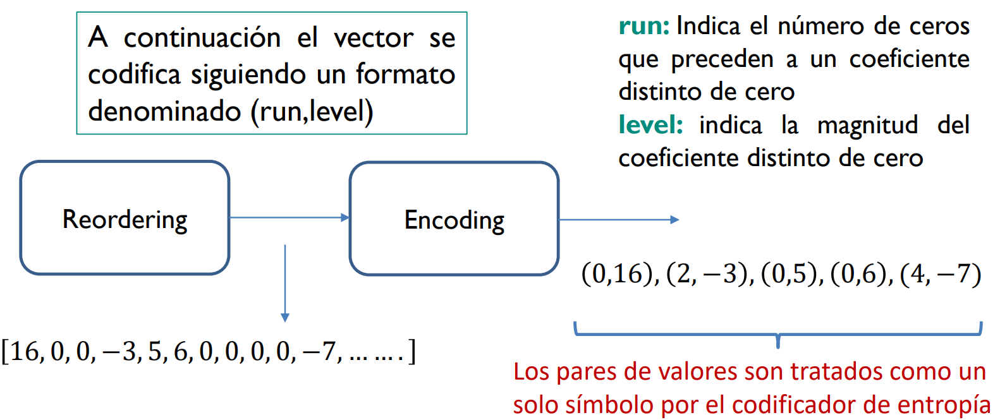

# Capitulo 3: Procesamiento Digital de Video

El proceso de **compresión de video** es un proceso de **compactación de datos** en numero menor de bits.
- La compresión de video tiene el proposito de generar un video digital con un **formato adecuado** para la **transmisión** o **almacenamiento**.
- El video sin compresión es conocido como un formato **raw video** que demanda una gran cantidad de recursos de la red.

> Compresor -> Encoder: Convierte los datos que provienen de una fuente en formato de compresión, reduciendo el tamaño en bits.

> Descompresor -> Decoder: Convierte los datos comprimidos de regreso a la representación original del video.

$$
CODEC = enCOder + DECoder
$$

- La compresión de datos se basa en **remover la información redundate**, es decir eliminar **componentes que no son nesesarios para una reproducción fiel de los datos**.

- Los datos contienen **redundancia estadísticia** porr lo cual pueden ser comprimidos empleando **mecanismos sin perdidas** (lossless compression).

- En los esquemas sin perdidas, al realizar la recontrucción se puede recurperar de manera "perfecto" los datos originales, pero eso no sucede asi, no hay esquemas perfectos, ya que para comprimir un archivo se necesita una mayor reducción y por ende **perdida de datos redundates**, esto a su vez debe existir una **reducción de calidad visual**.

- Asi la **compresión de video** se basa en el principio de eliminar los elementos de una imagen o frame y que estos no afecten de forma significativa la percepción de la calidad visual.

Es asi pues que los **mecanismos de compresión de video** aprovechan caracteristicas de:

1. Redundancia Espacial
2. Redundancia Temporal

- Es pues asi que en el dominio temporal, existe una alta correlación entre frames de un video.
- Tambien en el dominio espacial, existe una correlación entre las muestra o pixels cercanos.

Es pues asi que los estandares de compresion se basan en modelos que emplean:

- Tecnicas de predicción
- Compensación de movimiento
- Transformaciones
- Cuantización
- Tecnicas estadísticas (entropía)

> Pregunta de Investigación: ¿Qué es On2 Technologies y qué relación tiene con Youtube?
Los codécs de On2 Technologies fueron desde sus orígenes una buena alternativa a otros códecs privativos, siendo desarrollados para competir directamente con codécs de vídeo como por ejemplo Windows Media Video, RealVideo, MPEG-4 y H. 264/MPEG-4 AVC. El propietario es Google.

Estandares de compresión son:
1. H.264
2. MPEG-2
3. VP9
4. SMPTE

> Que significa transcodificar?

La transcodificación es la conversión de un archivo multimedia digital, como un archivo de vídeo o audio, de un formato a otro.

> Es posible transcodificar un video con VLC?

Si, VLC es un reproductor multimedia libre y a su ves un transcodificador

> ¿Qué relación existe entre un CODEC y las extensiones .avi, .wma, .mp4, .mks .mpeg, .ts, .mov?

Las extensiones es un formato contenedor que puede tener un codec de video, audio y metadatos, un ejemplo es matroska (.mkv). [Mas info](https://www.youtube.com/watch?v=ehs57rVCShA)

> Raw archivos en bruto.

> ¿Qué es un video container?

Un formato contenedor es un tipo de formato de archivo que almacena información de vídeo, audio, metadatos e información de sincronización y corrección de errores siguiendo un formato preestablecido en su especificación técnica.

> Que es un metafile?

| **Formatos de Video** | **Propietario**             | **Extensión** | **Codecs Soportados** |
|-----------------------|-----------------------------|---------------|-----------------------|
| AVI                   | Microsoft                   | .avi          | H.264                 |
| MATROSKA              | Matroska                    | .mkv          | H.264, on2, VC-1      |
| MP4                   | Movie Picture Experts Group | .mp4          | H.264                 |
| MXF                   | SMPTE                       | .mxf          | VC-1                  |
| OGG                   | Xiph.Org Foundation         | .ogg          | Theora                |
| QUICKTIME             | Apple                       | .mov          |  H.264, on2, VC-1     |

## Video CODEC
El encoder esta conformado por tres principales elementos:

1. Prediction Model
2. Spatial Model
3. Entropy Encoder

En resumen se necesita una fuente de video en RAW, luego ejecutar un proceso de predicción en base a datos codificados almacenados, a traves de el se obtiene un residuo con el cual se genera un modelo espacial y valores de coeficientes. Luego se realiza un codificador de entropia con dichos coeficientes y parametros de predicción obtenidos del modelo de predicción.

- El **prediction Model** tiene el objetivo de reducir la redundancia analizando las similitudes entre frames.

La diferencia entre frames se le denomina frame residual, y constituye el ingreso a la función de **spatial model**.

- El **spatial model** analizara las similitudes entre las muestras locales en el frame residual para reducir la redundancia espacial.

El realizado se realiiza convirtiendo a las muestra otro dominio, en este caso se hace uso de la DCT o transformada del coseno, y como resultado se obtiene un conjunto de coeficientes.

Los coeficientes son cuantizados para remover los valores menos significativos.

- La funcion del **entropy encoder** sera encargarse de remover la redundancia estadistica de los datos, por ejemplo vectores que ocurren con frecuencia.

Asi el codificador de entropia genera como resultado una cadena de tramas de bits comprimida, la misma que puede ser almacenada o transmitida.

### Predicción Temporal
El frame resultante necesita frames de referencia, por lo que seran *frames previos o pasados* o *frames futuros*.

Zonas mas iluminadas, diferencia positiva, y diferencias positivas seran las zonas mas oscuras. Los grises seran valores de cero.

Se puede reducir la cantidad de información empleando la compensación de movimiento. Los cambios entre frames se pueden deber a:

1. Movimiento
2. Regiones no cubiertas o no enfocadas por la camara
3. Cambios de Luz

Y los movimientos pueden ser movimientos de objetos rigidos y de objetos deformables. 

El **optical flow** sera un campo de vectores de movimientos entre frames, nos indicara la trayectoria para cada pixel.

Este mecanismo no es practico debido a que genera una carga computacional muy significativo y requiere el intercambio de vectores para cada pixel.

Un mecanismo practico es utilizar secciones rectangulares o **macrobloques** (blocks) de un frame con dimensiones de NxN muestras o pixels. A traves de este procedimiento se obtiene macrobloques residuales, y existira un offset entre el bloque actual y laposicion de la region seleccionada y este se denominara **vector de movimiento**.

Si existe un cambio de escena es preferible realizar la codificacion del macrobloque sin compensacion de movimiento.

Entre las desventajas de usar la **compensasión de movimiento** por macrobloques se encuentra a que en la vida real no hay bordes rectangulares bien definidos, por lo que ciertos movimientos pueden resultar complejos de compensar.

Un macrobloque corresponde a una región de 16x16 pixels de un frame, y son empleados en esquemas de codificación como el MPEG y H.26x

Para un formato de pixel 4:2:0, los macrobloques se organizan de la siguiente manera:

Organizando un macrobloque de 16x16 con 256 muestras de luminancia y organizados en cuatro bloques de 8x8.

Existirian 64 muestras de cominancia de tipo Cb (blue) organizadas en un solo bloque de 8x8 y 64 muestras de crominancia de tipo Cr (red) organizadas en bloques de 8x8

Como resultados tenemos 6 bloques de 8x8, y el codec H.264/AVC procesa cada frame de video en unidades de macrobloques.

### Modelo de Imagen

Para el modelo de imagen o *spatial model* o etapa de transformación consiste en tomar la información residual generada por el modelo de predicción y conertirla en un formato adecuado para su posterior compresión utilizando el codificador de entropia.

Existen tres etapas para el modelo de imagen:

1. Transformación
2. Cuantización 
3. Reordenamiento

Para la etapa de transformación, sera convertir la imagen o los datos residuales en otro dominio para ello existen opciones:

1. Basadas en Imagenes: 
Opera sobre la imagen o el frame completo y utiliza mucha carga computacional. Por ejemplo la Discree Wavelet Transform (DWT)
2. Basadas en Bloques: Procesa la transformación basada en bloques de una imagen, tiene menor carga computacional, tiene limitaciones con las formas y movimientos de los objetos. Aqui se encuentra la transformada discreta del coseno.

La DCT emplea unicamente cosenos, y presenta caracteristicas de compactacion de energia, concentrando la mayor parte de la informacion en pocos coeficientes relevantes, ademas no realiza operaciones complejas.

Dichas ecuaciones anteriores tambien pueden expresarse en forma matricial.

Definamos a X como la matriz de muestras, a Y como la matriz de coeficientes y a A como la matriz de transformación.

### Reordenamiento
Se sigue una estructura de zig-zag y despues se usa un formato:

$$
(run, level)
$$

**run**: Indica el numero de ceros que preceden a un coeficiente distinto de cero.
**level**: Indica la magnitud del coeficiente distinto de cero.

en la salida del reordenamiento existe otro formato:

$$
(run, level, last)
$$

**run**: Indica el numero de ceros que preceden a un coeficiente distinto de cero.
**level**: Indica la magnitud del coeficiente distinto de cero.
**last**: Indica el numero de unos que sigue despues del coeficiente distinto de cero.

La salida del reordenamiento sera considerado como un solo simbolo por el codificador de entropia.

