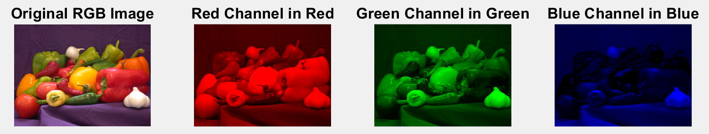
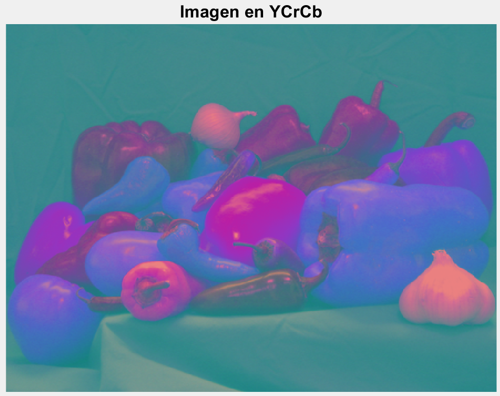
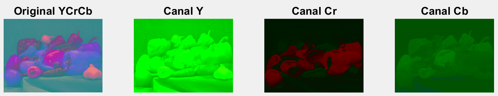

```matlab
rgbImage = imread('peppers.png');

redChannel = rgbImage(:,:,1); % Red channel
greenChannel = rgbImage(:,:,2); % Green channel
blueChannel = rgbImage(:,:,3); % Blue channel

allBlack = zeros(size(rgbImage, 1), size(rgbImage, 2), 'uint8');

just_red = cat(3, redChannel, allBlack, allBlack);
just_green = cat(3, allBlack, greenChannel, allBlack);
just_blue = cat(3, allBlack, allBlack, blueChannel);


subplot(1, 4, 1);
imshow(rgbImage);
fontSize = 20;
title('Original RGB Image', 'FontSize', fontSize)

subplot(1,4,2);
imshow(just_red);
title('Red Channel in Red', 'FontSize', fontSize)

subplot(1,4,3);
imshow(just_green)
title('Green Channel in Green', 'FontSize', fontSize)

subplot(1,4,4);
imshow(just_blue);
title('Blue Channel in Blue', 'FontSize', fontSize)
```



```
ycbcrImage = rgb2ycbcr(rgbImage);
figure
imshow(ycbcrImage)
title('Imagen en YCrCb','FontSize', fontSize)
```



```
yChannel = ycbcrImage(:,:,1); % Y channel
crChannel = ycbcrImage(:,:,2); % Cr channel
cbChannel = ycbcrImage(:,:,3); % Cb channel

allBlack = zeros(size(ycbcrImage, 1), size(ycbcrImage, 2), 'uint8');

just_y = cat(3, yChannel, allBlack, allBlack);
just_cr = cat(3, allBlack, crChannel, allBlack);
just_cb = cat(3, allBlack, allBlack, cbChannel);

YY = ycbcr2rgb(just_y);
CbCb = ycbcr2rgb(just_cb);
CrCr = ycbcr2rgb(just_cr);

    %Display the Original Image.  
figure, imshow(ycbcrImage), title('Original Image')
    %Display the Y(black and white) Component.
figure, imshow(YY), title('Y Component')
    %Display the Cb Component.
figure, imshow(CbCb), title('Cb Component')
     %Display the Cr Component.
figure, imshow(CrCr), title('Cr Component')
```



